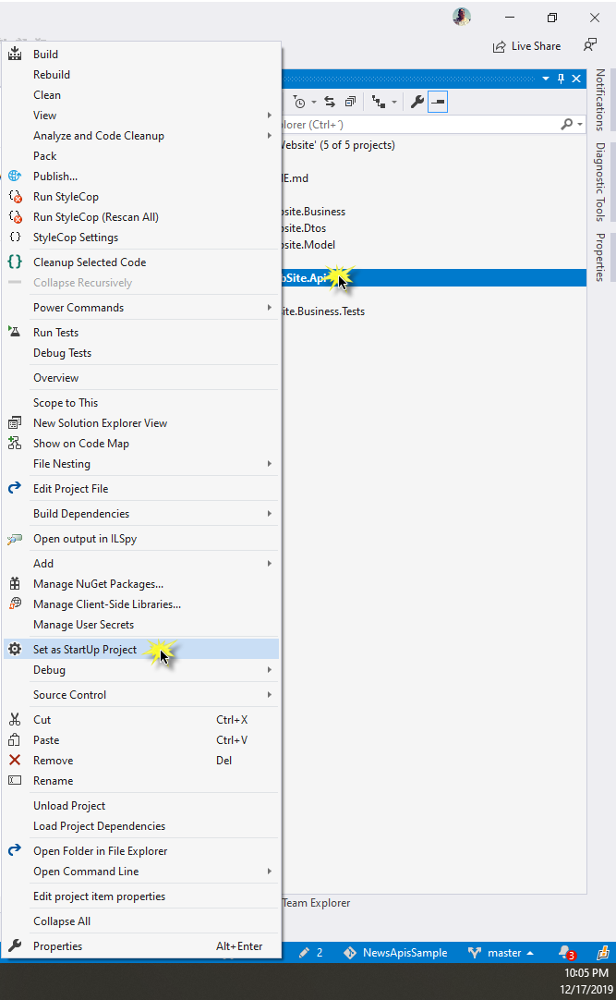

# NewsApiSample

Repository with an ASP.Net sample based in a News API.

## How run the project

To run the project, you should select the **MyWebSite.Api** project and then **Set as StartUp Project**, as showed in the following image:

After it, you can run the project pressing F5 and selecting IIS Express.

The enpoint **https://localhost:44387/api/stories/beststories/** should showed (because it was configured in launchSettings.json file)

    // 20191217220932
    // https://localhost:44387/api/stories/beststories/

    {
      "stories": [
        {
          "title": "Nebraska farmers vote overwhelmingly for Right to Repair",
          "uri": "https://uspirg.org/blogs/blog/usp/nebraska-farmers-vote-overwhelmingly-right-repair",
          "postedBy": "howard941",
          "time": "0001-01-01T00:02:37.6521229",
          "score": 1503,
          "commentCount": 400
        },
        {
          "title": "JetBrains: $270M revenue, 405K paying users, $0 raised",
          "uri": "https://twitter.com/chetanp/status/1205907182396395525",
          "postedBy": "matt2000",
          "time": "0001-01-01T00:02:37.6425141",
          "score": 1153,
          "commentCount": 653
        },
        {
          "title": "SQL Murder Mystery",
          "uri": "https://mystery.knightlab.com/",
          "postedBy": "kickscondor",
          "time": "0001-01-01T00:02:37.6456703",
          "score": 801,
          "commentCount": 79
        },
        {
          "title": "ICANN Delays .ORG Sale Approval",
          "uri": "https://www.icann.org/news/blog/org-update",
          "postedBy": "watchdogtimer",
          "time": "0001-01-01T00:02:37.6458084",
          "score": 718,
          "commentCount": 84
        },
        {
          "title": "Engineer says Google fired her for notifying co-workers of right to organize",
          "uri": "https://www.nbcnews.com/news/all/security-engineer-says-google-fired-her-trying-notify-co-workers-n1103031",
          "postedBy": "danso",
          "time": "0001-01-01T00:02:37.6592268",
          "score": 665,
          "commentCount": 635
        },
        {
          "title": "Google is not a search engine, but an ad engine",
          "uri": "https://twitter.com/dhh/status/1205582897593430017",
          "postedBy": "jlelse",
          "time": "0001-01-01T00:02:37.6415769",
          "score": 536,
          "commentCount": 279
        },
        {
          "title": "Calm Technology",
          "uri": "https://calmtech.com/",
          "postedBy": "brundolf",
          "time": "0001-01-01T00:02:37.6453062",
          "score": 431,
          "commentCount": 151
        },
        {
          "title": "WebAssembly becomes a W3C Recommendation",
          "uri": "https://www.w3.org/2019/12/pressrelease-wasm-rec.html.en",
          "postedBy": "galaxyLogic",
          "time": "0001-01-01T00:02:37.6508871",
          "score": 428,
          "commentCount": 235
        },
        {
          "title": "Kansas City is first major city in U.S. to offer no-cost public transportation",
          "uri": "https://www.citylab.com/transportation/2019/12/free-transit-how-much-cost-kansas-city-bus-streetcar-fare/603397/",
          "postedBy": "jonbaer",
          "time": "0001-01-01T00:02:37.6529671",
          "score": 426,
          "commentCount": 368
        },
        {
          "title": "Unbearable news",
          "uri": "https://zainamro.com/notes/unbearable-news",
          "postedBy": "zuhayeer",
          "time": "0001-01-01T00:02:37.6440398",
          "score": 413,
          "commentCount": 150
        },
        {
          "title": "Google Brass Set 2023 as Deadline to Beat Amazon, Microsoft in Cloud",
          "uri": "https://www.theinformation.com/articles/google-brass-set-2023-as-deadline-to-beat-amazon-microsoft-in-cloud?pu=hackernewsyw3xln&utm_source=hackernews&utm_medium=unlock",
          "postedBy": "devhwrng",
          "time": "0001-01-01T00:02:37.660059",
          "score": 391,
          "commentCount": 423
        },
        {
          "title": "#include &lt;/etc/shadow&gt;",
          "uri": "https://blog.hboeck.de/archives/898-include-etcshadow.html",
          "postedBy": "pcr910303",
          "time": "0001-01-01T00:02:37.655377",
          "score": 372,
          "commentCount": 107
        },
        {
          "title": "Hacking GitHub's Auth with Unicode's Turkish Dotless 'I'",
          "uri": "https://eng.getwisdom.io/hacking-github-with-unicode-dotless-i/",
          "postedBy": "_jg",
          "time": "0001-01-01T00:02:37.6544065",
          "score": 349,
          "commentCount": 217
        },
        {
          "title": "Boeing to Suspend 737 Max Production in January",
          "uri": "https://www.wsj.com/articles/boeing-to-suspend-737-max-production-in-january-11576532032",
          "postedBy": "JumpCrisscross",
          "time": "0001-01-01T00:02:37.6534084",
          "score": 329,
          "commentCount": 248
        },
        {
          "title": "You might literally be buying trash on Amazon",
          "uri": "https://www.wsj.com/articles/you-might-be-buying-trash-on-amazonliterally-11576599910",
          "postedBy": "mudil",
          "time": "0001-01-01T00:02:37.6600369",
          "score": 324,
          "commentCount": 318
        },
        {
          "title": "France's AMF watchdog fines Bloomberg €5M over Vinci hoax",
          "uri": "https://www.reuters.com/article/us-france-amf-bloomberg/frances-amf-watchdog-fines-bloomberg-5-million-over-vinci-hoax-idUSKBN1YK1VN",
          "postedBy": "ComodoHacker",
          "time": "0001-01-01T00:02:37.6582857",
          "score": 324,
          "commentCount": 204
        },
        {
          "title": "BMW shares AI tools used in production",
          "uri": "https://www.bmwblog.com/2019/12/13/bmw-shares-ai-algorithms-used-in-production-available-on-github/",
          "postedBy": "saranshk",
          "time": "0001-01-01T00:02:37.6425854",
          "score": 317,
          "commentCount": 38
        },
        {
          "title": "An opinionated approach to GNU Make",
          "uri": "https://tech.davis-hansson.com/p/make/",
          "postedBy": "DarkCrusader2",
          "time": "0001-01-01T00:02:37.6583628",
          "score": 297,
          "commentCount": 146
        },
        {
          "title": "LogMeIn Acquired by Private Equity",
          "uri": "https://techcrunch.com/2019/12/17/logmein-agrees-to-be-acquired-by-francisco-partners-and-evergreen-for-4-3b/",
          "postedBy": "AznHisoka",
          "time": "0001-01-01T00:02:37.6593738",
          "score": 284,
          "commentCount": 237
        },
        {
          "title": "Faults in Post Office accounting system led to workers being convicted of theft",
          "uri": "https://www.bbc.co.uk/news/uk-england-50747143",
          "postedBy": "scratchy_beard",
          "time": "0001-01-01T00:02:37.6400246",
          "score": 284,
          "commentCount": 102
        }
      ]
    }